**Title:**
"We Said, Yes!"

**About Us:**
"We Said, Yes!" is a wedding invitation website where your guests can see the wedding details and respond with an RSVP message to the host. We make your big day even more special with the presence of your family and friends. Let's have a joyous celebration of love, together with our loved ones!

 //Insert screenshots of the website here

**Table of Contents:**

* Design
* Features

	* Existing Features  

           1. Languages Used  

           2. Navigation  

           3. Home Page Hero Image  

           4. Home Page  

           5. Footer  

           6. Wedding Invitation  

           7. RSVP  

           8. Thank You Page  

        * Future Features
* Testing  

       1. Validator Testing  

       2. Bugs  

* Libraries & Programs Used
* Deployment
* Credits  

       1. Content  

       2. Media  

**Design:**
I started with a wireframe on paper with pencil as shown below:  

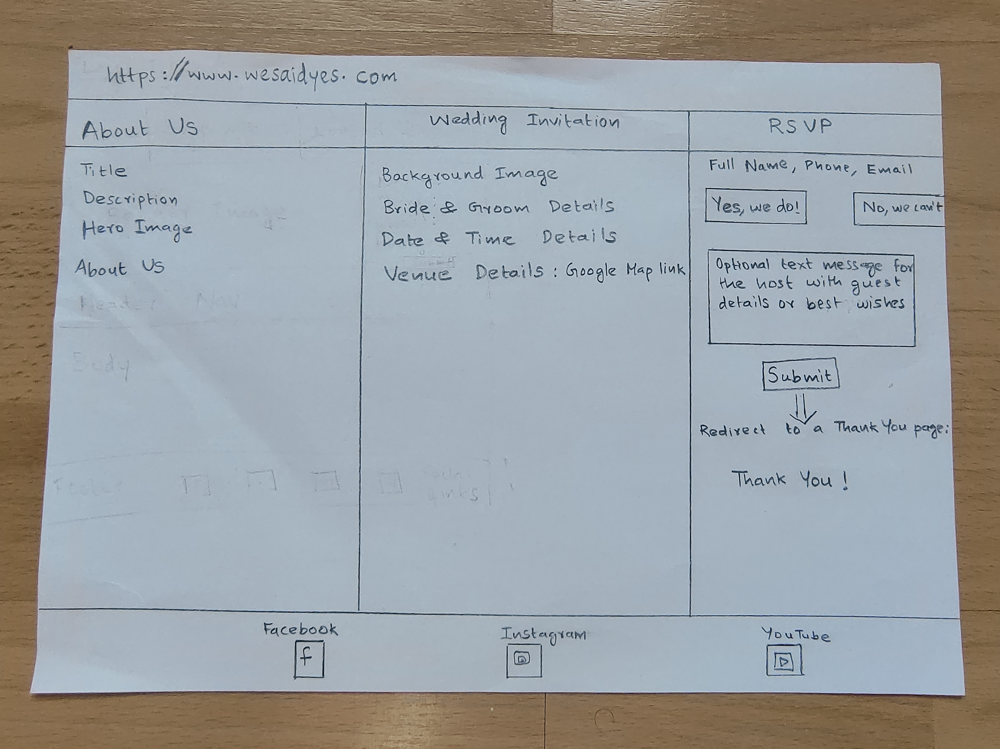  

* Text & Background colour:  

  I selected both the text and background colours suitable for a wedding invitation. I wanted to keep the colour palette breezy with pastel colours and include images related to wedding. I have used a darker shade for the header and the footer to provide some contrast from the main sections.

**Features:**

**Existing Features:**
1. Header
2. Navigation bar
3. About us page
4. Wedding invitation page with the Wedding details and Google Map link
5. RSVP form
6. Thank you page
7. Social media links in the footer

**Languages Used:**
+ HTML5
+ CSS3

**Navigation:**  

A hamburger menu icon is provided at the right-hand side of the header for the user to easily locate and use for navigation purposes.  

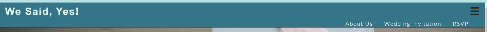  

**Home Page Hero Image**  

A Hero Image is used on the “About Us” Page (only) under the Header. The cover text over the Hero Image, 'About Us', has been added to enhance  the design.  

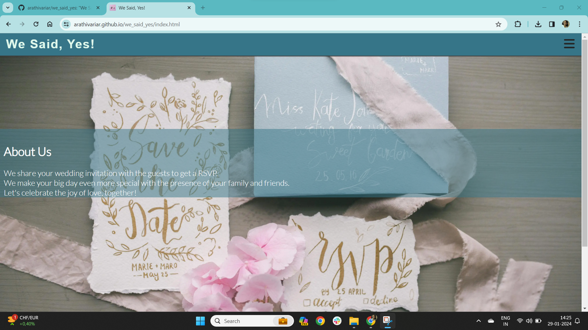  

**About Us page**  

This page provides the user an idea about what the website provides. I have used a minimalistic approach with just one hero image and some description text about what we do.  

  

**Wedding Invitation page**  

In this page, the user can find the details about the wedding like the bride and groom, wedding date and time and wedding venue. Also, there is a Google Maps link to reach the venue. There is a pretty background image on this page for the invitation text.   

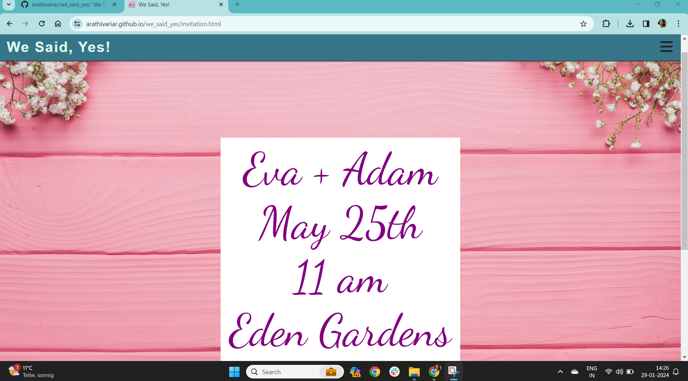   

**RSVP page**  

Here in this page, the user can respond to the invitation with an RSVP. The RSVP form had input fields for First Name, Last Name, Phone Number, Email Address, Radio Buttons to accept or decline the invitation, a text are for an optional message to the host and a submit button. 
Once the user submits the form, it redirects to a “Thank You” page.   

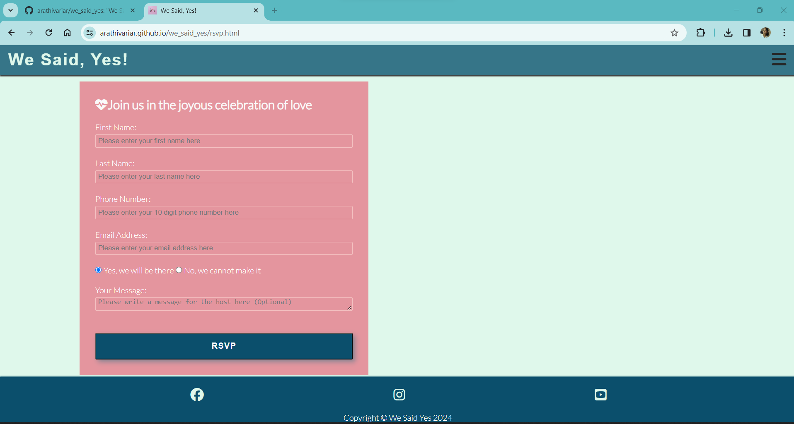  

**Thank You page**  

This page has an image with a  simple Thank you message for the users once they submit their RSVP response.  

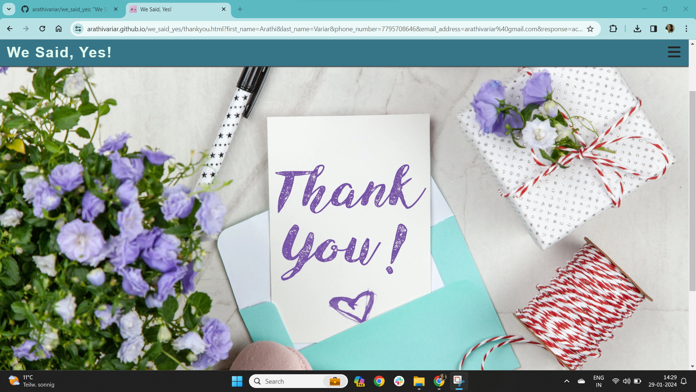  

**Footer**  

The footer section includes the links to three social media sites and a text indicating that this is copyrighted to “We Said, Yes!”.   

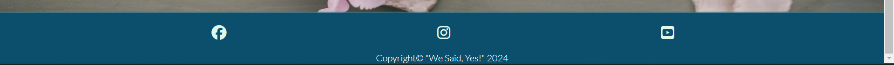   

**Future Features:**  

1. The host will receive the list of RSVP responses by all the guests so that they can properly plan the wedding.
2. The user can select the invitation template from a list of avilable templates.

**Testing:**  

Testing of the website is done by me, my family, and friends on various devices like mobile phones, tablet, laptop, and desktop. We have verified that the navigation to all the pages, all the links, and the RSVP form (including all the input fields)  are working as expected.
We have tested the website on both Google Chrome (used for the development) and Microsoft Edge to ensure that the website worked on different browsers.

**Validator Testing:**  

* HTML: No errors were returned when passing through the official W3C validator. 

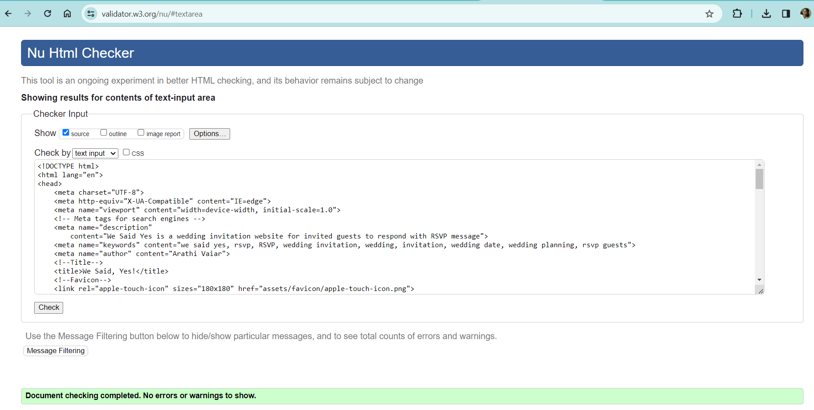   

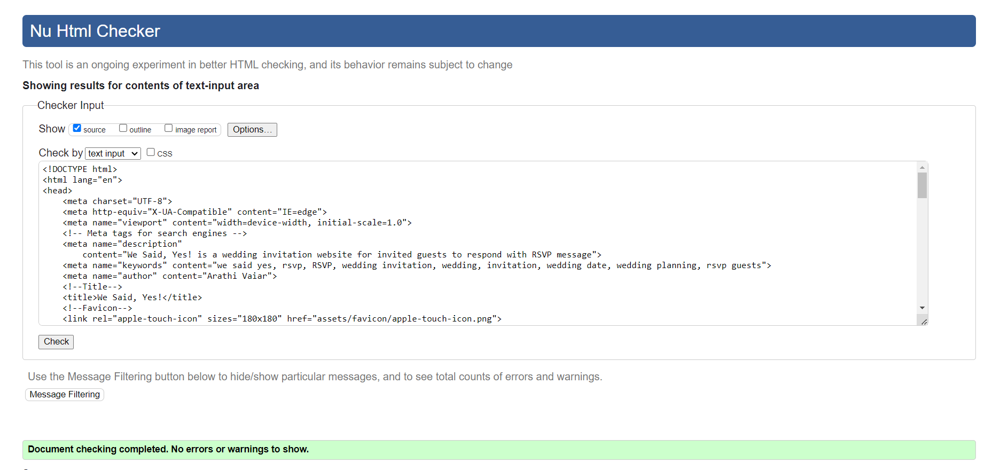  

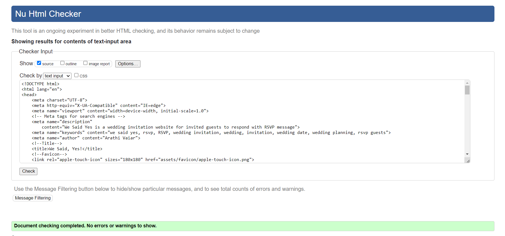   

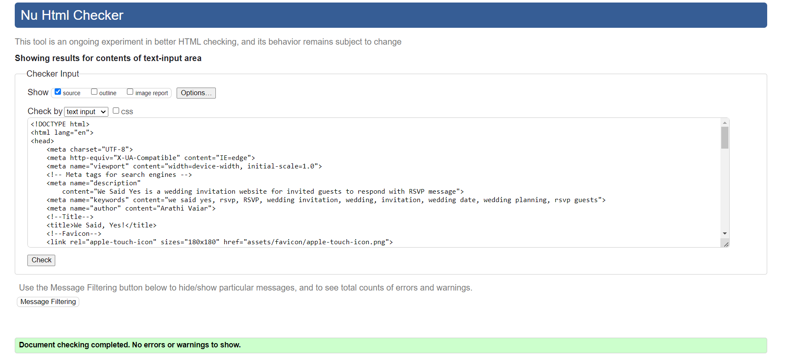   

* CSS: No errors were found when passing through the official (Jigsaw) validator.   

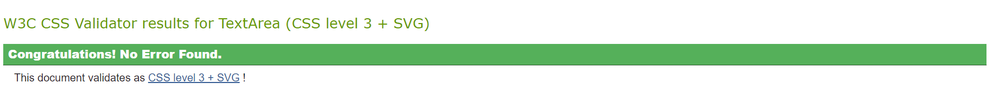  

* Lighthouse (Accessibility Audit): The page achieved a great accessibility performance as shown below:   

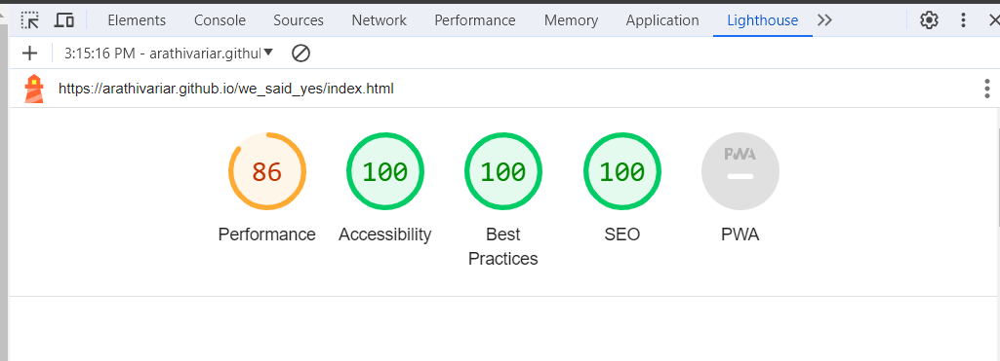   

_Note:_ The above screenshot show the results of the index.html page. All the pages had great accessibility performance while validation testing.   

**Bugs:**  

During the development phase, there were a few minor bugs related to the look and feel of the website. I was able to fix all the bugs through trial and error using Development Tools. I also Googled whenever I had some issues like not able to find the icons I am looking for, a few CSS properties like flexbox were not working as expected. I have given due credit to all the content and media in the credits section of this document.
There are no unfixed bugs existing in this website as per my knowledge.

**Libraries and Programs Used:**  

* Github: Code Repository
* Gitpod: Development IDE
* Google Fonts: https://fonts.google.com/
* Font Awesome: https://fontawesome.com/
* Convertio to convert .jpg images to .webp: https://convertio.co/webp-converter/
* Favicon generator to convert image to favicon: https://favicon.io/favicon-converter/

**Credits for Content & Media:**
* Pexels for images: https://www.pexels.com/
* Love Running project and Coders Coffee project : I used these two projects as my reference for HTML design and CSS styling of various elements.
* My Mentor Martina for her guidance and the Slack Community for their support.

**Deployment:**

The website is deployed to GitHub pages. The steps to deploy are as follows:

In the GitHub repository, navigate to the Settings tab.
From the Settings tab, select the 'Pages' tab in the 'Code and Automation' section.
From the source section drop-down menu, select the 'Main' branch.
Also, check the folder selected is set to / (root) and click Save.
Return to the 'Code' tab of GitHub repo and wait a few minutes for the build to finish.
Refresh the page. Click on github-pages to view the Deployments History. Click View deployment to open the live URL.

_Note:_ The live link for the site can be found here: https://arathivariar.github.io/we_said_yes/